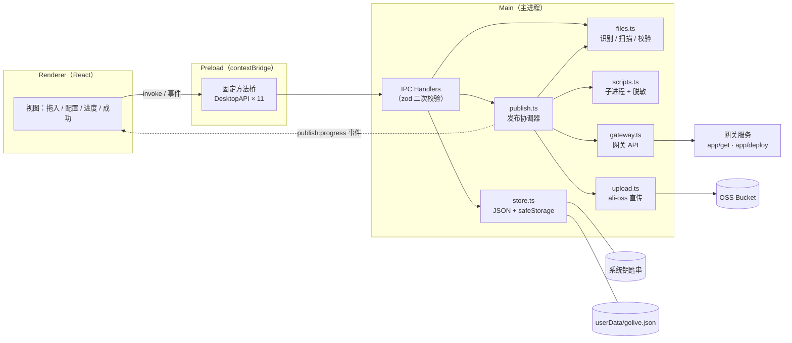
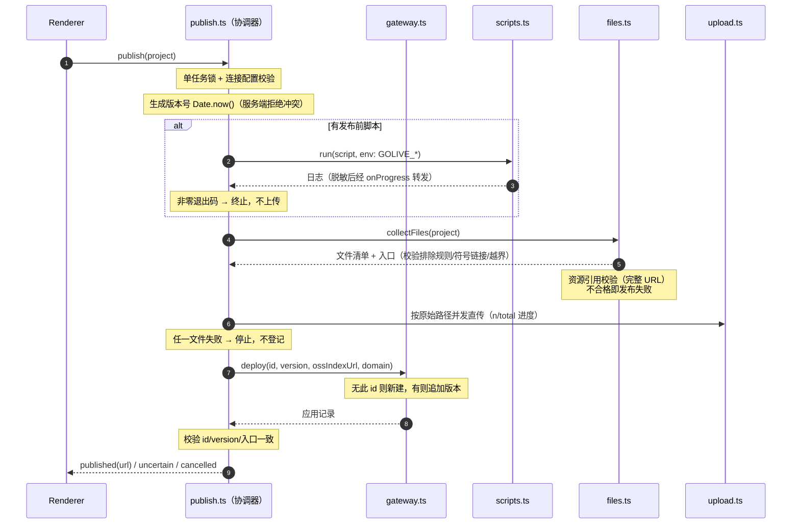

# GoLive

把本地 Web 页面快速发布到线上、并获得访问地址的轻量桌面工具（Electron）。

**核心流程：选择内容 → 执行可选脚本 → 上传 OSS → 登记发布 → 获取访问地址。**

用户把项目、构建产物目录或单个 HTML 拖进来，必要时执行构建脚本，点击发布，拿到可以复制和分享的网址。首次配置连接后，同一个项目再次发布只需一次点击。

- 产品方案：[docs/PRODUCT.md](./docs/PRODUCT.md)（范围、页面交互、验收清单）
- 技术方案：[docs/TECHNICAL.md](./docs/TECHNICAL.md)（接口契约、发布顺序、边界处理）

## 快速开始

```sh
pnpm install
pnpm dev        # 开发模式（electron-vite，热更新）
pnpm build      # 生产构建
pnpm typecheck  # TypeScript 类型检查
pnpm test       # 单元测试（node:test，31 个用例）
pnpm pack       # 构建并打包 macOS .app 目录（未签名公证）
```

要求 Node.js 20+ 与 pnpm 10+。第一版以 macOS 开发验证为主。

## 技术栈

| 项目 | 选型 |
| --- | --- |
| 桌面框架 | Electron + electron-vite |
| 界面 | React 19 + TypeScript + 原生 CSS |
| 参数校验 | Zod（`packages/core` 统一定义） |
| 文件解析 | cheerio（HTML 识别与资源引用校验） |
| OSS 上传 | ali-oss（主进程直传） |
| 打包 | electron-builder |

## Monorepo 结构

```text
app-golive/
├── apps/desktop/               # Electron 桌面应用
│   ├── electron.vite.config.ts
│   └── src/
│       ├── main/               # 主进程：本地能力 + 发布协调
│       │   ├── index.ts        # 窗口生命周期、IPC 注册、安全策略
│       │   ├── files.ts        # 输入识别、文件清单扫描、HTML/CSS 副本改写
│       │   ├── store.ts        # 本地持久化 + safeStorage 凭据加密
│       │   ├── scripts.ts      # 发布前脚本（子进程、进程组终止、日志脱敏）
│       │   ├── upload.ts       # OSS 直传适配
│       │   ├── gateway.ts      # 网关 API 客户端（查询/登记）
│       │   └── publish.ts      # 发布任务协调器（核心编排）
│       ├── preload/            # contextBridge 受限桥接
│       │   └── index.ts        # 只暴露固定业务方法，不暴露原始 ipcRenderer
│       └── renderer/           # React 界面
│           └── src/
│               ├── App.tsx     # 视图路由 + 发布状态机
│               └── views/      # Home / Config / Settings / Success
├── packages/core/              # 环境无关共享包：类型、zod 校验、URL 工具
│   └── src/index.ts
├── fixtures/demo/              # 自包含 HTML 验证样例
├── tests/                      # 发布关键路径测试（node:test）
└── docs/                       # 产品与技术方案
```

## 整体架构

### 进程模型与安全边界

三个进程各司其职，凭据与文件系统只存在于主进程：



安全规则：

- 本机工具：凭据明文存放于 userData 配置文件，设置页明文回显；发布日志输出前做脱敏。
- Preload 只暴露固定业务方法，不暴露任意 IPC 通道。
- 所有 IPC 入参在主进程用 zod 重新校验；外链校验 HTTP(S) 后才交给系统浏览器。
- 脚本日志经过凭据脱敏（`redact`）后才转发给界面。

### 发布链路时序

`publish.ts` 是核心编排器，一次完整发布的执行顺序（对应 docs/TECHNICAL.md §6）：



失败与不确定状态的处理原则：

| 情况 | 行为 |
| --- | --- |
| 脚本非零退出 | 直接失败，不上传、不登记 |
| 部分文件上传失败 | 发布失败，不登记新版本，旧线上版本不受影响 |
| deploy 网络超时/断网 | 带退避重查 `app/get`；能对上版本则视为成功，否则返回 `uncertain`（结果待确认），**不自动重发** |
| 服务端明确拒绝 | 抛 `ApiError`，界面展示接口错误 |
| 应用已停用或无域名 | 登记已保存，但生成访问地址失败并明确提示，不展示误导性网址 |
| 用户取消 | 脚本/上传阶段可取消（进程组 SIGTERM→SIGKILL）；进入登记阶段后不可取消 |

### Preload 暴露的 API 一览

| 方法 | IPC 通道 | 作用 |
| --- | --- | --- |
| `load()` | `state:load` | 读取脱敏后的设置与最近项目 |
| `select(kind)` | `dialog:select` | 系统对话框选目录 / HTML 文件 |
| `inspect(path)` | `project:inspect` | 识别路径，生成配置建议（不执行项目代码） |
| `pathForFile(file)` | —（webUtils） | 拖入的 File 还原为本地绝对路径 |
| `saveProject(p)` | `project:save` | 保存项目配置（按路径记忆） |
| `saveSettings(s)` | `settings:save` | 保存连接设置（含明文凭据，整体落盘） |
| `publish(p)` | `publish:start` | 发布全流程入口，返回三态结果 |
| `cancel()` | `publish:cancel` | 取消当前发布（登记阶段不可取消） |
| `open(url)` | `util:open` | 系统浏览器打开 HTTP(S) 链接 |
| `copy(text)` | `util:copy` | 写入剪贴板 |
| `onProgress(cb)` | `publish:progress` 事件 | 订阅进度/日志，返回解绑函数 |

### 本地数据

全部保存在 `userData/golive.json`（明文 JSON）：

```jsonc
{
  "settings": { /* 连接配置与凭据，明文 */ },
  "projects": [ /* 最近 12 条项目配置，按路径记忆 */ ]
}
```

- 纯本机工具，凭据不出本机，直接明文存放；设置页明文回显、可直接编辑；
- 写入串行化 + 临时文件 rename 原子替换；
- 配置不写回用户源码目录。

### 构建产物要求

网关只回源 HTML、客户端**只校验不改写**任何文件内容，因此产物必须自洽：

- **HTML**：资源引用（`src` / `srcset` / `poster` / `<link href>`）必须是完整 URL（`http(s)://` 或 `//`）或 `data:`——页面由网关在自有域名回源，相对与根路径都会 404；
- **CSS**：相对地址天然自洽（相对 CSS 文件自身在 OSS 的位置），仅根路径 `url(/...)`、`@import "/..."` 不允许；
- 发布前扫描 HTML/CSS，命中即**发布失败**并给出修复指引，错误信息含具体引用位置。

构建时注入资源基址即可满足要求（脚本环境变量由客户端提供）：

```sh
pnpm exec vite build --base "$GOLIVE_ASSET_BASE"
```

## 测试

`pnpm test`（node:test + tsx），覆盖发布关键路径：

- 三种输入的识别与入口约束、隐藏文件排除、符号链接与越界拒绝；
- 资源引用校验：HTML 完整 URL 放行、相对/根路径失败并提示基址，CSS 相对放行；
- 完整链路调用顺序、脚本失败/部分上传失败不登记；
- 已有应用域名沿用、版本号递增、重复版本拒绝；
- deploy 网络失败后的确认与 `uncertain` 分支；
- 取消清理、凭据脱敏。

## 当前状态

第一版功能已实现：typecheck 通过、31 个测试全部通过、macOS `.app` 可打包产出。**尚未完成真实环境联调**（需要有效的网关地址与 OSS 凭据），详见 docs/TECHNICAL.md §11 验证计划。
