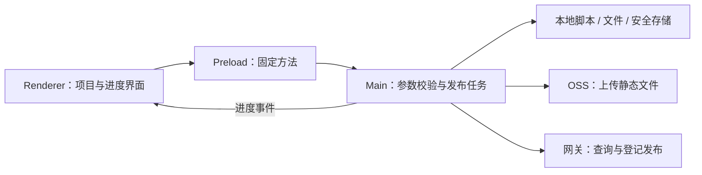

# GoLive 客户端技术方案

版本：v0.1 草案 · 2026-09-07  
状态：供技术评审；当前代码只是部分骨架，不能据此认定客户端可运行。

产品范围见 [产品文档](./PRODUCT.md)。

## 1. 技术选择

| 项目 | 方案 | 状态 |
| --- | --- | --- |
| 桌面构建工具 | electron-vite | 用户已指定 |
| 仓库结构 | pnpm workspace monorepo | monorepo 已指定，pnpm 为当前选择 |
| 桌面运行时 | Electron | 用户已指定 |
| 界面 | React + TypeScript + CSS | 实施建议 |
| 参数校验 | Zod | 实施建议 |
| OSS 上传 | 主进程通过 ali-oss SDK 直传 | 根据现有接口范围提出 |
| 本地持久化 | userData 中的 JSON + Electron safeStorage | 实施建议 |
| 打包 | electron-builder | 实施建议 |

使用的是 https://electron-vite.org/guide/cli 所述的 electron-vite。

```sh
pnpm install
pnpm dev        # workspace 转发到 electron-vite dev
pnpm build      # electron-vite build
pnpm typecheck
pnpm test
pnpm pack       # 构建后生成未安装的应用目录
```

`pack` 不是签名、公证或正式发布流程。第一版先验证 macOS；其他系统不能仅凭配置了打包 target 就视为已支持。

## 2. Monorepo 结构

```text
app-golive/
├── apps/
│   └── desktop/
│       ├── electron.vite.config.ts
│       └── src/
│           ├── main/             # Electron 主进程、本地能力与发布协调
│           │   ├── index.ts      # 窗口、生命周期、IPC 注册
│           │   ├── files.ts      # 检测输入、文件清单、上传副本资源处理
│           │   ├── store.ts      # 配置与安全存储
│           │   ├── scripts.ts    # 发布前脚本及终止进程
│           │   ├── upload.ts     # OSS 上传适配
│           │   └── publish.ts    # 发布任务状态与错误处理
│           ├── preload/          # 受限 contextBridge
│           └── renderer/         # React 界面
├── packages/
│   └── core/
│       └── src/                  # 环境无关类型、校验与接口契约
├── fixtures/demo/                # 自包含 HTML 验证样例
├── tests/                        # 发布关键路径与本地资源测试
└── docs/
```

以上是目标结构，部分文件尚未创建。

共享包保持小而明确：不包含 `fs`、Electron、shell 或长期 OSS 凭据。第一版不为了未来 Web 端提前拆出空的 UI 包、上传框架或 Web 应用。

## 3. 进程边界



- Renderer：表单、拖入、状态展示；不接触 Node.js、OSS Secret。
- Preload：只暴露业务方法，不暴露任意 IPC 通道或任意 shell 执行方法。
- Main：重新校验 IPC 参数，管理文件选择、发布快照、脚本进程、上传和网络请求。
- 浏览器窗口启用 `contextIsolation`、禁用 `nodeIntegration`，阻止任意导航与新窗口。
- 外链由主进程校验 HTTP(S) 后用系统浏览器打开。

建议暴露的业务方法：

```ts
load(): Promise<SavedState>
select(kind): Promise<string | null>
inspect(path): Promise<ProjectConfig>
saveProject(config): Promise<void>
saveSettings(settings): Promise<void>
publish(config): Promise<PublishResult>
cancel(): Promise<void>
copy(text): Promise<void>
open(url): Promise<void>
onProgress(listener): () => void
```

发布前脚本只能通过明确的 `publish(config)` 入口执行；拖入和检测不会执行项目代码。

## 4. 配置模型

### 4.1 项目配置

```ts
interface ProjectConfig {
  source: string       // 原始选中路径，用于恢复项目
  appId: string        // 服务端应用 id
  script: string       // 可为空；包含准备和构建命令
  cwd: string          // 脚本执行目录
  upload: string       // 相对 cwd 的路径，或绝对路径
  entry: string        // 相对上传目录的 HTML 入口
  domain: string       // 新应用的建议域名
  note: string         // 可选备注
}
```

`appId` 暂建议限制为小写字母、数字、连字符，以同时适配默认子域名和对象路径。这是客户端约束，比服务端的非空字符串约束更严格；已有特殊命名应用是否需要兼容，可在评审时调整。

### 4.2 全局配置

```ts
interface ConnectionSettings {
  apiUrl: string        // API 基础地址；不包含 /routers/app/deploy
  region: string
  bucket: string
  accessKeyId: string
  accessKeySecret: string
  publicBaseUrl: string // OSS/CDN 公共根地址，可带公共前缀
  domainSuffix: string
  protocol: 'https' | 'http'
}
```

当前骨架含一个可选 Token 预留字段。已读源码没有显示鉴权契约，正式接入前不把它作为必填项，也不认为服务端已经支持 Bearer Token。

### 4.3 本地保存

- 存放在 `app.getPath('userData')/golive.json`。
- 非敏感设置、最近项目配置保存为 JSON。
- Secret 使用 `safeStorage` 加密，只向界面返回“已保存”标记。
- 敏感字段留空表示保留原值；设置页须支持明确清除凭据，不能让用户无法删除。
- 系统安全存储不可用时不回退为明文保存。
- 串行化写入，使用临时文件 + rename，避免并发保存丢失配置。
- 配置不写回用户源码目录。

## 5. 已核实的服务端接口

参考源码：

- `/Users/lightfish/Project/Github_Pro/frontend-gateway/src/modules/alioss/routers.controller.ts`
- 同目录 `routers.dto.ts`、`routers.service.ts`、`routers.schema.ts`
- `/Users/lightfish/Project/Github_Pro/frontend-gateway/src/modules/gateway/gateway.service.ts`
- `/Users/lightfish/Project/Github_Pro/frontend-gateway/src/main.ts`

已检查的 `main.ts` 没有设置全局路由前缀。实际反向代理如果加了前缀，通过 API 基础地址配置。

### 5.1 查询应用

`POST /routers/app/get`

```json
{ "id": "my-web-app" }
```

返回单个应用记录，不存在时抛出 404。其他错误不能作为“应用不存在”处理。部署接入时还应识别错误体，避免将错误 API 路径的 404 当成新应用。

发布前查询用途：识别已有应用、读取实际域名与启用状态、辅助生成新版本号。

### 5.2 登记发布

`POST /routers/app/deploy`

```json
{
  "id": "my-web-app",
  "version": 1788782400000,
  "ossIndexUrl": "https://static.example.com/my-web-app/1788782400000/index.html",
  "domain": "my-web-app.lightfish.top",
  "note": "更新首页"
}
```

| 字段 | 服务端约束 | 客户端来源 |
| --- | --- | --- |
| `id` | 必填、非空字符串 | 项目应用名 |
| `version` | 必填、数值 | 自动生成的安全整数 |
| `ossIndexUrl` | 必填、非空字符串 | 实际上传入口 URL |
| `note` | 可选字符串 | 发布备注 |
| `domain` | 可选，仅新建生效 | 新应用域名 |
| `path` | 可选，仅新建生效 | MVP 不开放编辑 |
| `enable` | 可选，仅新建生效，默认 true | 使用服务端默认值 |
| `config` | 可选对象，仅新建生效 | MVP 不开放编辑 |

接口返回应用记录，包括 `id`、`domain`、`path`、`enable`、`currentVersion`、`ossIndexUrl`、`publishList` 等。

已存在的 id：只追加版本并切换当前版本，忽略新传入的 domain/path/config 等字段。同一应用的重复版本会被拒绝。

因此：

- 客户端不能把成功响应当作“域名修改成功”。
- 已有应用显示服务端实际域名；若与本地输入不一致，在执行前说明使用现有域名。
- 访问地址根据返回记录及配置的协议生成，不能只拼本地 appId。
- 接口中没有 `accessUrl` 返回字段，也没有 DNS 创建逻辑。

### 5.3 暂不调用

`document/read`、`document/replace`、`app/update`、`app/remove`、`app/rollback` 不进入第一版主流程。尤其不使用整份文档覆盖来完成单个应用发布。

### 5.4 上传接口边界

这个 controller 提供路由配置管理，不接收文件，也不发放 OSS 上传凭证。

**当前建议：桌面主进程使用用户配置的 OSS 凭据直传，再调用 deploy。** 这不是服务端新能力。如果后续希望服务端签发临时凭证或代理上传，需要另行接入对应接口。

## 6. 发布执行顺序

1. 对当前配置生成不可变快照，拒绝并发发布。
2. 校验连接配置、凭据、工作目录和输入路径。
3. 查询现有应用；明确处理不存在、停用、域名差异。
4. 生成独立版本号与对象前缀。
5. 有脚本则执行，等待正常退出；退出码非零立即停止。
6. 扫描最终上传内容，验证入口并生成文件清单。
7. 在内存或临时目录准备 HTML/CSS 上传副本，不修改原始文件。
8. 上传所有文件，报告文件数进度；全部成功后才进入下一步。
9. 调用 `app/deploy` 登记版本。
10. 验证响应中的 id、当前版本、入口 URL，生成实际访问地址。
11. 保存项目配置并展示结果；本地保存失败不能误报远程发布失败。

建议版本号使用 `max(Date.now(), lastKnownVersion + 1)`，并校验安全整数。它降低本机重复概率，但不提供跨客户端全局唯一保证；服务端冲突仍须明确处理。

对象前缀示例：

```text
my-web-app/<version>/index.html
my-web-app/<version>/assets/index.js
my-web-app/<version>/assets/index.css
```

文件夹保持相对结构；单文件使用 `index.html`。`publicBaseUrl` 与 Bucket 的路径映射必须由配置者保证一致。

## 7. 脚本执行

- 在 Main 中创建子进程，不在 Renderer 中执行。
- 工作目录固定为 `cwd`；路径以参数传入，不拼接进命令文本。
- 使用用户系统 shell；macOS 需要兼容 GUI 启动时 Node/pnpm PATH 与终端不同的情况。
- 多条命令按顺序执行，失败即停；不在未经用户触发时自动安装依赖。
- 收集 stdout/stderr，限制单次输出和总日志体积，对连接凭据脱敏。
- 在脚本进程环境中提供 `GOLIVE_APP_ID`、`GOLIVE_VERSION`、`GOLIVE_ASSET_BASE`，不把 OSS Secret 注入项目脚本。
- 暂不做专用环境变量编辑器；用户可以在脚本中设置自己的构建参数。
- macOS/Linux 按进程组终止子进程，必要时升级终止信号；Windows 需要单独实现进程树清理后才可宣称支持。

Vite 项目可显式使用资源基址，例如：

```sh
pnpm exec vite build --base "$GOLIVE_ASSET_BASE"
```

普通 `pnpm run build` 是否读取该变量取决于项目自身。客户端不能把提供环境变量等同于已自动配置所有框架。

## 8. HTML 与资源路径

已读网关实现会拉取 `ossIndexUrl` 对应的 HTML，并注入配置后返回。该方法没有把页面资源地址自动转换为 OSS 地址。

若线上 HTML 在 `my-web-app.lightfish.top`，但 JS/CSS 在 OSS，原始 `/assets/a.js` 或 `./assets/a.js` 可能请求错误位置。

方案：

- 优先支持构建时使用 `GOLIVE_ASSET_BASE` 生成正确的资源地址。
- 对上传副本中的相对资源引用设置合适的 `<base>`，将常见根路径资源引用映射到版本资源目录。
- 处理 HTML 的 script/link/img 等常见属性，以及 CSS 的根路径 `url()` / `@import`。
- 已有显式 base、子目录入口、远程地址、data URL、srcset 分别测试，不能简单全局字符串替换。
- 不改写任意 JavaScript 字符串，也不自动修改 API 请求地址。

限制：`<base>` 也会影响相对导航；JavaScript 动态拼接的根路径、运行时 fetch、复杂框架路由不保证自动兼容。优先验证常规 Vite 静态产物和简单 HTML。需要框架特殊部署配置时展示可操作的说明，不承诺“任意 Web 项目零配置”。

现有 `files.ts` 只是处理草稿，须通过下面的资源用例后才能认定可用。

## 9. 上传、取消与结果确认

### 上传

- 扫描目录时排除隐藏文件、`.env*`、`node_modules`，不跟随符号链接。
- 入口路径必须位于上传根目录内；拒绝路径穿越。
- 每个对象保留正确 Content-Type；转换 HTML/CSS 后上传对应副本。
- 上传使用有限并发；SDK 请求设置超时。
- MVP 进度显示“完成 n / total 个文件”，不伪装成精确字节进度。
- 失败时不登记版本；旧线上版本不受影响。未引用的 OSS 对象暂不清理。

### 取消

- 脚本/上传阶段允许取消，停止后续任务并结束子进程。
- 登记请求开始后不再显示可取消按钮。
- 关闭窗口时处理运行任务，不能留下孤立构建进程。

### 发布结果不确定

服务端保存 OSS 路由文档之后还会请求刷新网关；这些步骤并非一个事务。网络超时或刷新失败时，不能仅凭客户端收到错误就断定没有写入。

处理原则：

1. 记录本次 id、version 和 ossIndexUrl。
2. 查询 `app/get` 核对已登记的版本与入口。
3. 若记录一致，只能确认“登记已保存”；如先前请求失败，仍需区分网关刷新/访问是否完成。
4. 无法确认则展示“结果待确认”，保留诊断信息，不自动再次 deploy。

服务端还有短时配置缓存，查询不一致时应有限重查，不能无限轮询或立即覆盖发布。

## 10. 后续 Web 端边界

后续新增 `apps/web`，本轮不创建。

可复用：应用/发布类型、表单校验、API 请求契约、地址构造规则。

不可直接复用：本地绝对路径、系统 shell、Electron IPC、安全存储、长期 OSS 凭据。

Web 端只接收用户选择的已构建文件集。上传需要服务端临时凭证、签名上传或代理上传接口；不能把桌面端 Secret 放到浏览器中。浏览器支持目录选择、相对路径保存的细节留到 Web 端设计时处理。

## 11. 验证计划与实施顺序

| 顺序 | 交付 | 验证 |
| --- | --- | --- |
| 1 | electron-vite 窗口、选择与配置界面 | 启动、拖入、字段编辑、重启恢复 |
| 2 | 文件识别、脚本执行、资源副本 | 自包含 HTML、dist、脚本失败、子目录入口、取消 |
| 3 | OSS 适配与网关发布 | 用可注入适配器验证调用顺序、部分失败、接口错误 |
| 4 | 真实环境联调 | 已配置环境中上传、登记、打开页面和重复发布 |
| 5 | 构建与应用目录打包 | typecheck、测试、production build、打包启动 |

关键自动化用例：

- 源码/目录/单 HTML 识别与入口约束。
- 带本地资源的单 HTML、符号链接、越界入口。
- HTML/CSS 引用转换且源文件保持原样。
- 脚本失败不上传，部分上传失败不 deploy。
- 成功链路的请求字段与调用顺序。
- 重复版本、已有域名、停用应用和不确定响应。
- 取消清理、凭据不进入日志/Renderer。

真实 OSS 与域名联调需要有效连接配置；当前尚未取得，不会使用虚构成功记录替代真实验证。

## 12. 当前工程进度

已写入，但尚未完整测试：

- workspace、根脚本、TypeScript 配置。
- desktop 的 electron-vite 与 electron-builder 配置。
- `packages/core` 的初版类型、校验和 URL 工具。
- `files.ts` 的输入识别、扫描与资源处理草稿。
- `store.ts` 的本地保存与加密草稿。
- 一个自包含 HTML 样例。

尚未实现：

- Electron 窗口入口与 Preload 桥接。
- React 页面和全部交互。
- 脚本执行、OSS 上传、发布任务协调。
- 关键测试、端到端联调和打包验证。

依赖安装此前在 Electron 二进制下载阶段中断，已经发起镜像重试；当前尚未验证下载与启动完成。

**当前交付是可评审的方案与部分工程骨架，不是已完成的客户端。** 编码暂停在这里，先按评审反馈收敛再继续。
